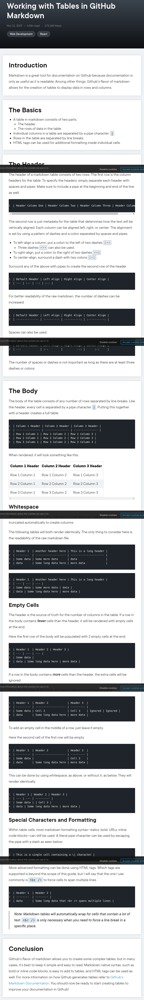

tables

https://www.pluralsight.com/guides/working-tables-github-markdown



## source

```
Introduction
Markdown is a great tool for documentation on Github because documentation is only as useful as it is readable. Among other things, Github's flavor of markdown allows for the creation of tables to display data in rows and columns.

The Basics
A table in markdown consists of two parts.
The header
The rows of data in the table
Individual columns in a table are separated by a pipe character: |.
Rows in the table are separated by line breaks.
HTML tags can be used for additional formatting inside individual cells.
The Header
The header of a markdown table consists of two rows. The first row is the column headers for the table. To specify the headers, simply separate each header with spaces and pipes. Make sure to include a pipe at the beginning and end of the line as well.

| Header Column One | Header Column Two | Header Column Three | Header Column Four |
The second row is just metadata for the table that determines how the text will be vertically aligned. Each column can be aligned left, right, or center. The alignment is set by using a pattern of dashes and a colon separated by spaces and pipes.

To left-align a column, put a colon to the left of two dashes :--.
Three dashes --- can also be used.
To right-align, put a colon to the right of two dashes --:.
To center-align, surround a dash with two colons :-:.
Surround any of the above with pipes to create the second row of the header.

| Default Header | Left Align | Right Align | Center Align |
| --- | :-- | --: | :-: |
For better readability of the raw markdown, the number of dashes can be increased.

| Default Header | Left Align | Right Align | Center Align |
| -------------- | :--------- | ----------: | :----------: |
Spaces can also be used.

| Default Header | Left Align | Right Align | Center Align |
| ---            | :--        |         --: |      :-:     |
The number of spaces or dashes is not important as long as there are at least three dashes or colons.

The Body
The body of the table consists of any number of rows separated by line breaks. Like the header, every cell is separated by a pipe character |. Putting this together with a header creates a full table:

| Column 1 Header | Column 2 Header | Column 3 Header |
| --------------- | --------------- | --------------- |
| Row 1 Column 1 | Row 1 Column 2 | Row 1 Column 3 |
| Row 2 Column 1 | Row 2 Column 2 | Row 2 Column 3 |
| Row 3 Column 1 | Row 3 Column 2 | Row 3 Column 3 |
When rendered, it will look something like this:

Column 1 Header	Column 2 Header	Column 3 Header
Row 1 Column 1	Row 1 Column 2	Row 1 Column 3
Row 2 Column 1	Row 2 Column 2	Row 2 Column 3
Row 3 Column 1	Row 3 Column 2	Row 3 Column 3
Whitespace
Whitespace before and after the text in a cell does not matter. It will be added or truncated automatically to create columns.

The following tables will both render identically. The only thing to consider here is the readability of the raw markdown file.

| Header 1  | Another header here | This is a long header |
| --------  | ------------------- | --------------------- |
| Some data | Some more data      | data                  |
| data      | Some long data here | more data             |
| Header 1  | Another header here | This is a long header |
| --- | --- | --- |
| Some data | Some more data | data |
| data | Some long data here | more data |
Empty Cells
The header is the source of truth for the number of columns in the table. If a row in the body contains fewer cells than the header, it will be rendered with empty cells at the end.

Here the first row of the body will be populated with 2 empty cells at the end.

| Header 1  | Header 2 | Header 3 |
| --- | --- | --- |
| Some data |
| data | Some long data here | more data |
If a row in the body contains more cells than the header, the extra cells will be ignored

Here the first row of the body will have 2 cells trimmed from the end.

| Header 1  | Header 2            | Header 3  |
| --------- | ------------------- | --------- |
| Some data | Cell 2              | Cell 3    | Ignored | Ignored |
| data      | Some long data here | more data |
To add an empty cell in the middle of a row, just leave it empty.

Here the second cell of the first row will be empty.

| Header 1  | Header 2            | Header 3  |
| --------- | ------------------- | --------- |
| Some data |                     | Cell 3    |
| data      | Some long data here | more data |
This can be done by using whitespace, as above, or without it, as below. They will render identically.

| Header 1 | Header 2 | Header 3 |
| --- | --- | --------- |
| Some data | | Cell 3 |
| data | Some long data here | more data |
Special Characters and Formatting
Within table cells, most markdown formatting syntax—italics, bold, URLs, inline code blocks—can still be used. A literal pipe character can be used by escaping the pipe with a slash as seen below:

| This is a single cell containing a \| character |
More advanced formatting can be done using HTML tags. Which tags are supported is beyond the scope of this guide, but I will say that the one I use commonly is <br /> to force cells to span multiple lines.

| Header 1  | Header 2 |
| --------  | -------- |
| data      | Some long data that <br /> spans multiple lines |
Note: Markdown tables will automatically wrap for cells that contain a lot of text. <br /> is only necessary when you need to force a line break in a specific place.

Conclusion
Github's flavor of markdown allows you to create some complex tables, but in many cases, it's best to keep it simple and easy to read. Markdown native syntax, such as bold or inline code blocks, is easy to add to tables, and HTML tags can be used as well. For more information on how Github generates tables refer to Github's Markdown Documentation. You should now be ready to start creating tables to improve your documentation in Github!
```


## translate

```
Вступ
Markdown — чудовий інструмент для документації на Github, оскільки документація корисна лише настільки, наскільки вона читабельна. Серед іншого, уцінка Github дозволяє створювати таблиці для відображення даних у рядках і стовпцях.

Основи
Таблиця в розцінці складається з двох частин.
Заголовок
Рядки даних у таблиці
Окремі стовпці в таблиці розділяються символом вертикальної лінії: |.
Рядки в таблиці розділені розривами рядків.
HTML-теги можна використовувати для додаткового форматування всередині окремих клітинок.
Заголовок
Заголовок таблиці розцінки складається з двох рядків. Перший рядок – це заголовки стовпців таблиці. Щоб указати заголовки, просто відокремте кожен заголовок пробілами та прямими. Не забудьте також включити трубу на початку і в кінці лінії.

| Перший стовпець заголовка | Другий стовпець заголовка | Третій стовпець заголовка | Колонка заголовка четверта |
Другий рядок — це просто метадані таблиці, які визначають, як текст буде вирівнюватися по вертикалі. Кожен стовпець можна вирівняти ліворуч, праворуч або по центру. Вирівнювання встановлюється за допомогою візерунка тире та двокрапки, розділених пробілами та прямими.

Щоб вирівняти стовпець за лівим краєм, поставте двокрапку зліва від двох тире :--.
Також можна використовувати три тире ---.
Щоб вирівняти по правому краю, поставте двокрапку праворуч від двох тире --:.
Щоб вирівняти по центру, обведіть тире двома двокрапками :-:.
Оточіть будь-який з перерахованих вище трубами, щоб створити другий ряд заголовка.

| Заголовок за замовчуванням | Вирівнювання по лівому краю | Вирівняти по правому краю | Вирівнювання по центру |
| --- | :-- | --: | :-: |
Для кращої читабельності вихідної розмітки кількість тире можна збільшити.

| Заголовок за замовчуванням | Вирівнювання по лівому краю | Вирівняти по правому краю | Вирівнювання по центру |
| -------------- | :--------- | ----------: | :---------------: |
Також можна використовувати пробіли.

| Заголовок за замовчуванням | Вирівнювання по лівому краю | Вирівняти по правому краю | Вирівнювання по центру |
| --- | :-- | --: | :-: |
Кількість пробілів або тире не має значення, якщо є принаймні три тире або двокрапки.

Тіло
Тіло таблиці складається з будь-якої кількості рядків, розділених розривами рядків. Як і заголовок, кожна клітинка розділена символом вертикальної лінії |. Поєднання цього разом із заголовком створює повну таблицю:

| Заголовок колонки 1 | Заголовок колонки 2 | Заголовок колонки 3 |
| --------------- | --------------- | --------------- |
| Рядок 1 Стовпець 1 | Рядок 1 Колонка 2 | Рядок 1 Колонка 3 |
| Рядок 2 Стовпець 1 | Рядок 2 Стовпець 2 | Рядок 2 Колонка 3 |
| Рядок 3 Колонка 1 | Рядок 3 Колонка 2 | Рядок 3 Колонка 3 |
При візуалізації це буде виглядати приблизно так:

Заголовок стовпця 1 Заголовок стовпця 2 Заголовок стовпця 3 Заголовок
Ряд 1 стовпець 1 рядок 1 стовпець 2 рядок 1 стовпець 3
Ряд 2 стовпець 1 рядок 2 стовпець 2 рядок 2 стовпець 3
Ряд 3 стовпець 1 рядок 3 стовпець 2 рядок 3 стовпець 3
Пробіли
Пробіли перед і після тексту в комірці значення не мають. Він буде доданий або обрізаний автоматично для створення стовпців.

Наведені нижче таблиці відображатимуться однаково. Єдине, що тут слід враховувати, це читабельність необробленого файлу уцінки.

| Заголовок 1 | Ще один заголовок тут | Це довгий заголовок |
| -------- | ------------------ | --------------------- |
| Деякі дані | Ще деякі дані | дані |
| дані | Деякі довгі дані тут | більше даних |
| Заголовок 1 | Ще один заголовок тут | Це довгий заголовок |
| --- | --- | --- |
| Деякі дані | Ще деякі дані | дані |
| дані | Деякі довгі дані тут | більше даних |
Порожні клітинки
Заголовок є джерелом істини для кількості стовпців у таблиці. Якщо рядок у тілі містить менше клітинок, ніж заголовок, він буде відтворюватися з порожніми клітинками в кінці.

Тут перший ряд тіла буде заповнений 2 порожніми клітинками в кінці.

| Заголовок 1 | Заголовок 2 | Заголовок 3 |
| --- | --- | --- |
| Деякі дані |
| дані | Деякі довгі дані тут | більше даних |
Якщо рядок у тілі містить більше комірок, ніж заголовок, додаткові клітинки ігноруватимуться

Тут перший ряд тіла буде мати 2 клітинки, обрізані з кінця.

| Заголовок 1 | Заголовок 2 | Заголовок 3 |
| --------- | ------------------ | --------- |
| Деякі дані | Комірка 2 | Комірка 3 | Проігноровано | Проігноровано |
| дані | Деякі довгі дані тут | більше даних |
Щоб додати порожню клітинку в середину рядка, просто залиште її порожньою.

Тут друга клітинка першого рядка буде порожньою.

| Заголовок 1 | Заголовок 2 | Заголовок 3 |
| --------- | ------------------ | --------- |
| Деякі дані | | Комірка 3 |
| дані | Деякі довгі дані тут | більше даних |
Це можна зробити, використовуючи пробіл, як вище, або без нього, як показано нижче. Вони відображатимуться однаково.

| Заголовок 1 | Заголовок 2 | Заголовок 3 |
| --- | --- | --------- |
| Деякі дані | | Комірка 3 |
| дані | Деякі довгі дані тут | більше даних |
Спеціальні символи та форматування
У клітинках таблиці більшість синтаксису форматування уцінки — курсив, жирний, URL-адреси, вбудовані блоки коду — все ще можна використовувати. Літеральний символ вертикальної лінії можна використовувати, екрануючи трубу за допомогою косої риски, як показано нижче:

| Це одна клітинка, що містить \| характер |
Більш розширене форматування можна виконати за допомогою HTML тегів. Теги, які підтримуються, виходять за рамки цього посібника, але я скажу, що я зазвичай використовую теги <br />, щоб змусити клітинки охоплювати кілька рядків.

| Заголовок 1 | Заголовок 2 |
| -------- | -------- |
| дані | Деякі довгі дані, які <br /> охоплюють декілька рядків |
Примітка. Таблиці розмітки автоматично переносять клітинки, які містять багато тексту. <br /> необхідний лише тоді, коли вам потрібно примусово розбити рядок у певному місці.

Висновок
Розцінка Github дозволяє створювати деякі складні таблиці, але в багатьох випадках краще, щоб вони були простими та зручними для читання. Вбудований синтаксис Markdown, такий як напівжирний або вбудований блок коду, легко додати до таблиць, а також можна використовувати теги HTML. Для отримання додаткової інформації про те, як Github створює таблиці, перегляньте [документацію Github Markdown](https://github.github.com/gfm/#tables-extension-) . Тепер ви повинні бути готові почати створювати таблиці для покращення вашої документації в Github!
```