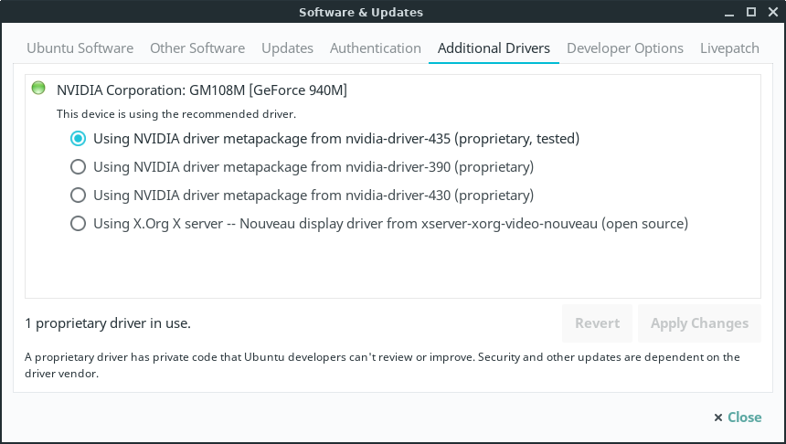
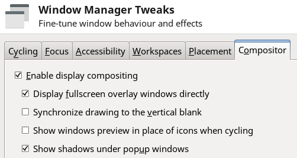
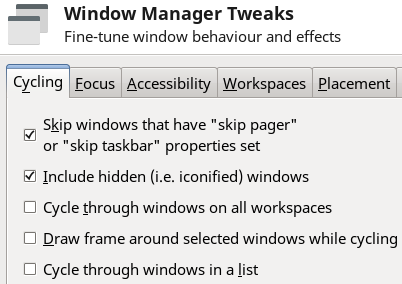
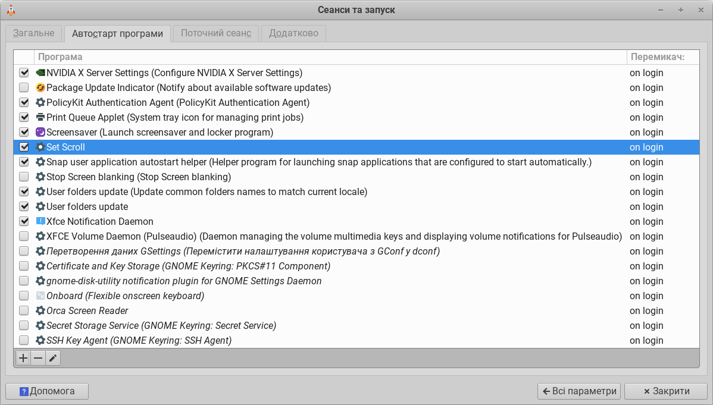

# LinuxLite

Зручні плагіни для візуального відображення заряду батареї та ресусів (процесор, пам'ять, своп, мережа) на панелі.

- xfce4-battery-plugin (актуальний для ноутбуків)
- xfce4-systemload-plugin

## "nouveau Error" на NVIDIA

Здається, проблеми з драйвером nouveau стосуються лише мого ноутбука з картою NVIDIA.

На відміну від Manjaro екран не блимав час від часу, але сотні строчок під час запуску та вимкнення ноута

```
... nouveau Error ...
... nouveau Error ...
... nouveau Error ...
```

не тільки не давали спокою, але і суттєво марнували мій час!

Але, на відміну від Manjaro, драйвер nVidia став на ноут з LinuxLite коректно.

### Встановлення драйвера NVIDIA

Інфу знайшов в локальній документації **file:///usr/share/doc/litemanual/hardware.html#nvidia** де радили ставити `proprietary, tested` - такий і вибрав.

`Menu` -> `Settings` -> `Install Drivers`



Перезавантажився, помилки зникли, все ок.


## Налаштування вигляду перемикача Alt-tab (Window Manager)

Не показувати зображення вікон, а лише іконки програм: **Show windows preview...** - off



Не виділяти площину активного вікна: **Drow frame around...** - off



## TouchPad

Мені зручно, щоби тачпад працював як прокрутка на планшеті: якщо проводимо пальцями вгору – сторінка рухається вгору, вниз – вниз. На деяких DE є така галочка в налаштуваннях тачпада, на XFCE LinuxLite - нема.

Тому створимо файл /home/soft/set_scroll, для швидкого встановлення значень:

```bash
#!/bin/bash
# Інверсує прокрутку, touchpad працює як на планшеті
synclient VertScrollDelta=-40 HorizScrollDelta=-90 MaxDoubleTapTime=100
```

Дамо йому дозвіл на виконання `chmod +x set_scroll` і додамо його до старту системи:


