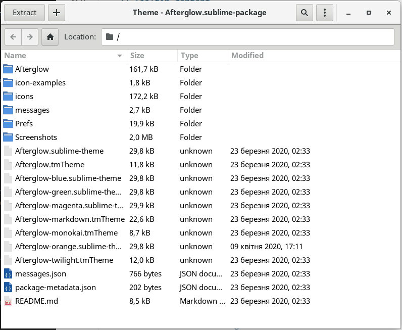
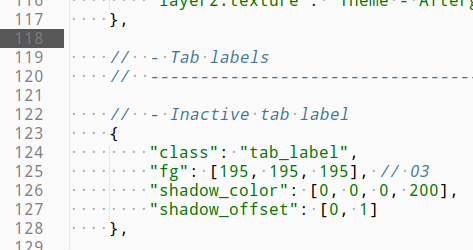
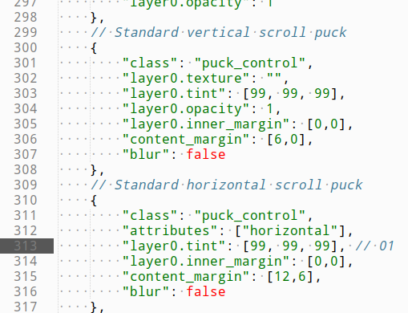
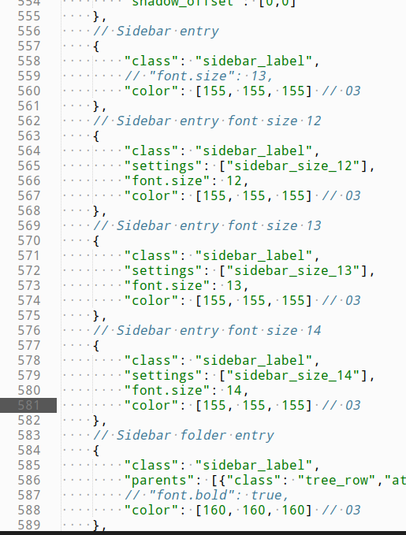
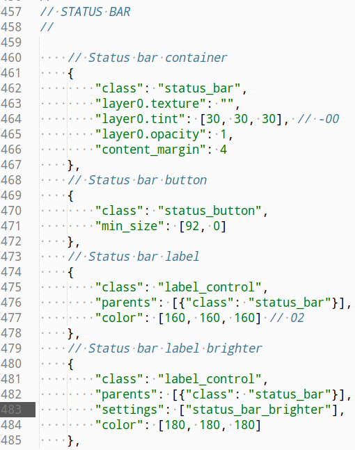

# Как подправить package

На примере темы Afterglow, но аналогично, я так понимаю, можно подправить любой пакет.

Итак, поставил понравившуюся тему (в ней же - подсветка синтаксиса) но шрифты слишком темные и плохо видны на темном фоне.

Сам пакет находится здесь: **/home/user/.config/sublime-text-3/Installed Packages/Theme - Afterglow.sublime-package**. Его можно открыть архиватором:

Я поставил тему "Orange", поэтому нашел и вытащил из архива соответствующий файл - **Afterglow-orange.sublime-theme**, в нем и делал правки.

Имена файлов во вкладках (потом, правда, я их отключил) "fg" `[195, 195, 195]`: 

Ползунки прокрутки вертикальные и горизонтальные, значения `[99, 99, 99]`:

Для файлов сайдбара - "color" `[155, 155, 155]`, там же и папки `[160, 160, 160]`

Текст в статус-строке "color" `[160, 160, 160]`:

Не знаю, когда используется "brighter", поднял и его (со 160 до 180)

Файл сохраняем и засовываем поверх обратно в архив. Закрываем и снова открываем Sublime. Цвета поменялись.

