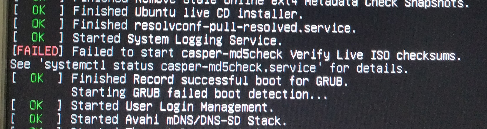

# Failed to start casper-md5check Verify Live ISO checksums



Запустив

    sudo systemctl status casper-md5check.service

Написало, що не може перевірити `/cdrom /cdrom/md5sum.txt` файл не існує...

Знайшов у `/etc/systemd/system/casper.target.wants/` файл `casper-md5check.service` з таким вмістом:

```
[Unit]
Description=casper-md5check Verify Live ISO checksums

[Service]
Type=oneshot
ExecStart=/usr/lib/casper/casper-md5check /cdrom /cdrom/md5sum.txt
RemainAfterExit=yes

[Install]
WantedBy=multi-user.target
```

Видалив цей файл з каталогом, все Ок.