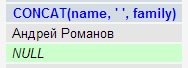
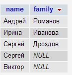
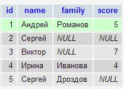
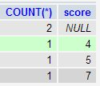

# NULL


## NULL or NOT NULL?

Используйте `NOT NULL`, если это возможно.

Если есть особые причины использовать `NULL` – используйте его. Но перед этим спросите себя – есть ли разница между пустой строкой и `NULL` (для `INT` – `0` или `NULL`). Если таких причин нет, используйте `NOT NULL`.

`NULL` занимает больше места и, к тому же, усложняет сравнения с таким полем. Избегайте его, если это возможно. Тем не менее, бывают веские причины использовать `NULL`, это не всегда плохо.

**Из документации MySQL:**

«Столбцы `NULL` занимают больше места в записи, из-за необходимости отмечать, что это `NULL-значение`. Для таблиц `MyISAM`, каждое поле с `NULL` занимает 1 дополнительный бит, который округляется до ближайшего байта».


# Подробнее про NULL поля в MySQL

<http://www.oridis.ru/articles/mysql_null_values.html>

## Вступление

Часто на форумах и даже в учебниках пишут о том, что лучше не использовать NULL поля в MySQL. В этих утверждениях смущает тот факт, что никто не удосуживается объяснить, почему NULL – это зло. Эта заметка призвана разобраться, что такое NULL в MySQL и так ли страшен чёрт, как его малюют.

## Что такое NULL?

Наряду с множеством типов данных в БД, NULL стоит особняком. NULL означает отсутствие значения.
Зачем использовать особый тип данных для того, чтоб указать отсутствие значения, когда можно просто вставить пустую строку, например? Этот вопрос мне всегда казался глупым, и я удивляюсь тому, как в книгах и статьях уделяют ему достаточное количество внимания.

Один пример. Таблица сайты содержит поле PR INT UNSIGNED NULL. PR – целочисленное значение, которое может быть равно нулю. Какое значение вставить в случае, когда PR ещё не рассчитан и, соответственно, неизвестен? NULL.

## Чем опасен NULL?


Сравнение NULL с любым другим значением, даже с родственным (в большинстве языков программирования, в частности, в PHP null, 0, false это одно и то же, если не применять строгого сравнения, которое включает сравнение типов) ему FALSE вернёт NULL. Отсюда следует первая ловушка.
Допустим, у нас есть таблица:

```mysql
CREATE TABLE users (
`id` INT UNSIGNED NOT NULL AUTO_INCREMENT,
`name` VARCHAR(255) NOT NULL,
`family` VARCHAR(255) NULL
);
```

Добавим в неё 2 записи:

```mysql
INSERT INTO users (name, family) VALUES(‘Андрей’, ‘Романов’), (‘Иван’, NULL);
```

В случае, если вы захотите объединить имя и фамилию, получив ФИО одним полем, например, таким запросом:

```mysql
SELECT CONCAT(name, ' ', family) FROM `users`
```

MySQL не оправдает ваших ожиданий. Вы получите NULL вместо Ивана.



Немного неожиданно, правда?

На деле же ничего неожиданного нет, если вы помните, что любая операция с NULL вернёт NULL, кроме специальных операций, предназначенных для работы с NULL: IS NULL, IS NOT NULL, IFNULL()

## Сортировка по NULL


Всего лишь хочу опровергнуть некоторые фразы из русского мануала MySQL о том, что при сортировке по столбцу, содержащим NULL значения, эти самые NULL значиния всегда оказываются наверху. Это не так.

```mysql
SELECT name, family FROM `users` ORDER BY family ASC
```


```mysql
SELECT name, family FROM `users` ORDER BY family DESC
```



Как видим, NULL считается наименьшим значением, и порядок сортировки на него действует.

## Группировки и NULL


Все просто.

MySQL группирует по NULL так же как и по любому другому полю.

Добавим нашей таблице users столбец score INT UNSIGNED NULL;



Подсчитаем сколько всего пользователей набрали то или иное количество очков, т.е. сгруппируем выборку по полю score

```mysql
SELECT COUNT(*), score FROM `users` GROUP BY score
```



Как видно, MySQL сгруппировала 2 строки с score = NULL

## Индексы и NULL


Откуда-то ходит заблуждение о том, что MySQL не использует индексы, если столбец может принимать значения NULL.

Это не так! http://dev.mysql.com/doc/refman/5.0/en/is-null-optimization.html

Проведём несколько экспериментов.

Выберем все записи, где score = NULL. Не забываем, что мы для этого должны использовать конструкцию IS NULL

```mysql
EXPLAIN SELECT * FROM `users` WHERE score IS NULL
```


Индекс используется.

Выберем все записи, где количество очков больше, например, пяти.

```mysql
EXPLAIN SELECT * FROM `users` WHERE `score` > 5
```


Индекс используется.

Найдем пользователя, у которого ровно 7 очков

```mysql
EXPLAIN SELECT * FROM `users` WHERE `score` = 7
```


Индекс используется.

Можно сделать вывод: заблуждение действительно таковым и оказалось.

Можно смело использовать NULL-поля при создании индекса и индекс будет работать.


### Отдельно стоит отметить индекс типа UNIQUE.

Мы рассмотрели выше, что MySQL группирует по NULL как по обычному значению и все строки с score = NULL были сгруппированы в один кортеж. Из этого может последовать ложный вывод о том, что не получится использовать UNIQUE индекс вместе с NULL полем. Однако это не так. **Для UNIQUE** индекса - **NULL является** вполне себе **уникальным значением**, и MySQL без каких-либо препятствий позволит вставить несколько строк с NULL значениями поля, представляющего UNIQUE индекс.

## Когда следует использовать NULL?


Ранее я привел пример таблицы сайтов, которая содержит поле PR.
PR – это целочисленное значение, которое может принимать значение 0, к тому же оно может быть в состоянии «не посчитано». Как реализовать хранение такого свойства в таблице?

Те, кто боится использовать NULL, и создают pr как INT UNSIGNED NOT NULL DEFAULT 0; вынуждены добавлять ещё одно поле в таблицу, например, pr_calculated TINYINT(1) DEFAULT 0. По нему они проверяют, посчитан ли PR или нет. Соответственно, если pr = 0 и pr_calculated = 0, значит, что pr не действительно равен нулю, а всего лишь не посчитан. Не слишком ли много условий?

Зачем отказываться от того, что язык предлагает тебе «из коробки»?

Значение NULL для такого поля подходит идеально. NULL – означает «нет значения», т.е. оно ещё не посчитано. Если значение равно нулю, значит оно действительно равно нулю. Все просто.

Второй пример подходящего случая для использования NULL – это поле-потомок.

Поле-потомок указывает на id записи из другой (или же этой же таблицы). Примером такого поля может быть parent_id.

Те, кто боится использовать NULL, создают столбец parent_id INT UNSIGNED NOT NULL DEFAULT 0. Если parent_id никуда не указывает – оно содержит значение, равное нулю. При этом, архитектор предполагает, что в таблице не будет записей с значением id = 0. Соглашусь с тем, что MySQL по-умолчанию, начинает инкремент с единицы, но это не означает, что в таблице не может появиться записи с id = 0. Запись появиться может, потому что БД этого не запрещает.

Когда мы создаем поле parent_id как INT UNSIGNED NULL, то мы сводим вероятность того, что строка в результате каких-то действий будет указывать через parent_id на реально существующую строку, к нулю! В MySQL нет возможности создать запись с id = NULL, когда id является автоинкрементальным полем.

## Выводы

Нет причин бояться создания NULL полей. Надо хорошо понимать, что NULL в MySQL это не ноль и не false – это отсутствие значения. Надо знать, как MySQL работает с NULL: нюансы есть, но их не много. У MySQL нет проблем с индексацией NULL полей.

