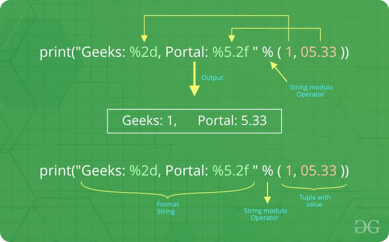
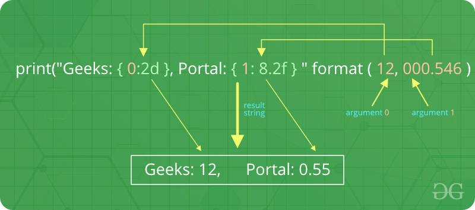

# Форматування виводу

<https://www.geeksforgeeks.org/python-output-formatting/>

Є кілька способів представити вихідні дані програми. Дані можуть бути надруковані у формі, зрозумілій людині, або записані у файл для подальшого використання, або навіть у іншій визначеній формі. Користувачі часто хочуть більше контролювати форматування виводу, ніж просто друкувати значення, розділені пробілами. Існує кілька способів форматування виводу. 

- Щоб використовувати відформатовані рядкові літерали , починайте рядок із `f` або `F` перед лапками, що відкривають або потрійними лапками.
- Метод рядків `format()` допомагає користувачеві створити вишуканіший результат
- Користувачі можуть виконувати всю обробку рядків, використовуючи операції нарізки та конкатенації рядків, щоб створити будь-який макет, який забажають користувачі. Рядковий тип має деякі методи, які виконують корисні операції для доповнення рядків до заданої ширини стовпця.

### Форматування виводу за допомогою оператора String modulo (%):

Оператор `%` також можна використовувати для форматування рядка. Він інтерпретує лівий аргумент так само, як формат у стилі `printf()`, як у рядках мови C, які застосовуються до правого аргументу. У Python немає функції `printf()`, але функціональність стародавнього `printf` міститься в Python. З цією метою оператор `%` перевантажується класом `string` для виконання форматування рядка. Тому його часто називають рядковим оператором модуля (або іноді навіть модулем). 

Рядковий модульний оператор ( % ) все ще доступний у Python(3.x) і широко використовується. Але нині старий стиль форматування вилучено з мови. 

```python
# Python program showing how to use string modulo operator(%) to print fancier output

# print integer and float value
print("Geeks : %2d, Portal : %5.2f" % (1, 05.333))

# print integer value
print("Total students : %3d, Boys : %2d" % (240, 120))

# print octal value
print("%7.3o" % (25))

# print exponential value
print("%10.3E" % (356.08977))
```

```
Вивід: 

Geeks: 1, Portal: 5.33
Total students : 240, Boys: 120
    031
3,561E+02
```



У нашому прикладі їх два: «%2d» і «%5.2f». Загальний синтаксис заповнювача формату: 

```%[flags][width][.precision]type```

Давайте подивимося на заповнювачі в нашому прикладі.  

- Перший заповнювач `%2d` використовується для першого компонента нашого кортежу, тобто цілого числа 1. Число буде надруковано з 2 символів. Оскільки 1 складається лише з однієї цифри, вихід доповнюється 1 пробілом на початку.
- Другий `%5.2f` є описом формату для числа з плаваючою точкою. Як і інші заповнювачі, він вводиться символом `%`. Далі йде загальна кількість цифр, яку має містити рядок. Це число включає десяткову кому та всі цифри, тобто до та після коми.
Наше число 05.333 має бути відформатовано 5 символами. Десяткова частина числа або точність встановлюється на 2, тобто число, що стоїть після `.` у нашому заповнювачі. Нарешті, останній символ `f` нашого заповнювача означає `float`.


### Форматування виводу за допомогою методу format:

Метод `format()` додано в Python(2.6). Метод форматування рядків вимагає більше ручних зусиль. Користувачі використовують `{}`, щоб позначити, де змінна буде замінена, і можуть надати детальні директиви форматування, але користувач також повинен надати інформацію для форматування. Цей метод дозволяє нам об’єднувати елементи в межах виводу за допомогою позиційного форматування. Наприклад - 

Код 1:

```python
# Python program showing
# use of format() method

# using format() method
print('I love {} for "{}!"'.format('Geeks', 'Geeks'))

# using format() method and referring
# a position of the object
print('{0} and {1}'.format('Geeks', 'Portal'))

print('{1} and {0}'.format('Geeks', 'Portal'))

# the above formatting can also be done by using f-Strings
# Although, this features work only with python 3.6 or above.

print(f"I love {'Geeks'} for \"{'Geeks'}!\"")

# using format() method and referring
# a position of the object
print(f"{'Geeks'} and {'Portal'}")
```

Вивід

```
I love Geeks for "Geeks!"
Geeks and Portal
Portal and Geeks
```

Дужки та символи в них (так звані **поля формату**) замінюються об’єктами, переданими в метод `format()`. Число в дужках можна використовувати для позначення положення об’єкта, переданого в метод `format()`. 

Код 2

```python
# Python program showing
# a use of format() method

# combining positional and keyword arguments
print('Number one portal is {0}, {1}, and {other}.'
	.format('Geeks', 'For', other ='Geeks'))

# using format() method with number
print("Geeks :{0:2d}, Portal :{1:8.2f}".
	format(12, 00.546))

# Changing positional argument
print("Second argument: {1:3d}, first one: {0:7.2f}".
	format(47.42, 11))

print("Geeks: {a:5d}, Portal: {p:8.2f}".
	format(a = 453, p = 59.058))
```

Вивід

```
umber one portal is Geeks, For, and Geeks.
Geeks :12, Portal :    0.55
Second argument:  11, first one:   47.42
Geeks:   453, Portal:    59.06
```

На наступній діаграмі з прикладом використання показано, як метод format працює для позиційних параметрів: 



Код 3: 

```python
# Python program to
# show format() is
# used in dictionary

tab = {'geeks': 4127, 'for': 4098, 'geek': 8637678}

# using format() in dictionary
print('Geeks: {0[geeks]:d}; For: {0[for]:d}; '
	'Geeks: {0[geek]:d}'.format(tab))

data = dict(fun ="GeeksForGeeks", adj ="Portal")

# using format() in dictionary
print("I love {fun} computer {adj}".format(**data))
```

Вихід: 

```
Geeks: 4127; For: 4098; Geeks: 8637678
I love GeeksForGeeks computer Portal
```

### Форматування виводу за допомогою методу String:

цей вивід форматується за допомогою операцій нарізання рядка та конкатенації. Рядковий тип має кілька методів, які допомагають форматувати вивід у вигадливіший спосіб. Деякі методи, які допомагають форматувати вивід, це `str.ljust()`, `str.rjust()` і `str.centre()`

```python
# Python program to
# format a output using
# string() method

cstr = "I love geeksforgeeks"

# Printing the center aligned
# string with fillchr
print ("Center aligned string with fillchr: ")
print (cstr.center(40, '#'))

# Printing the left aligned
# string with "-" padding
print ("The left aligned string is : ")
print (cstr.ljust(40, '-'))

# Printing the right aligned string
# with "-" padding
print ("The right aligned string is : ")
print (cstr.rjust(40, '-'))
```

вивід

```
Center aligned string with fillchr: 
##########I love geeksforgeeks##########

The left aligned string is : 
I love geeksforgeeks--------------------

The right aligned string is : 
--------------------I love geeksforgeeks
```

