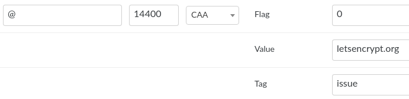

# Let's Encrypt

<https://letsencrypt.org/ru/docs/>

## Создание и настройка сертификата сервере

[Let's Encrypt: получение сертификата по шагам](https://habr.com/ru/post/270273/) 2015-2017

на примере Mirohost

Для того что бы подключить Let's Encrypt сертификат в КП необходимо прейти:
МОИ ДОМЕНЫ > Управление доменами > Выбрать домен
Выбрать > Сертификаты SSL
поставить галочки для ваших доменов и субдоменов (если необходимо)
Затем нажать "Создать сертификат", подождать пока активируется сертификат и потом нажать "Включить"

[Инструкция Мирохост](https://mirohost.net/support/hosting-technical/kak-sozdat-ssl-sertifikat-v-kontrolnoj-paneli-mirohost)

## Настройки домена

на примере nic.ua

Необходимо добавить CAA запись:

    CAA <flags> <tag> <value>

например:

    @             CAA 0 issue "letsencrypt.org"

    example.com.  CAA 0 issuewild "comodoca.com"

[подробнее](https://support.dnsimple.com/articles/caa-record/)

### На nic.ua

## Links

- [Получаем бесплатный SSL сертификат от Let's Encrypt](https://codex.so/ssl)

## Keys

<button>ssl</button> <button>lets encrypt</button> <button>https</button> <button>mirohost</button> <button>nic.ua</button>

